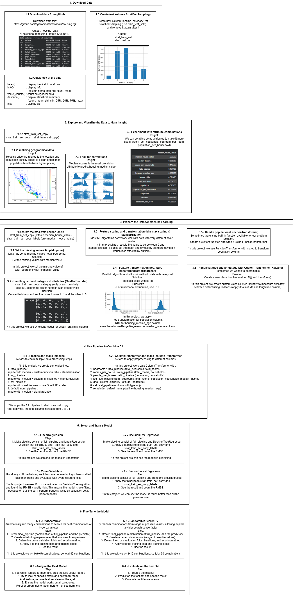

# Housing Price Prediction

## 🔍 Overview

This project implements an end-to-end machine learning workflow to predict house price in California districts.
The project is based on concepts from Chapter 2 of Hands-On Machine Learning with Scikit-Learn, Keras, and TensorFlow, re-implemented from scratch with my own structure, analysis, and experiments.

## 📖 Learning Resources

- Hands-On Machine Learning with Scikit-Learn, Keras, and TensorFlow (Chapter 2)

## 🗺️ Diagram

